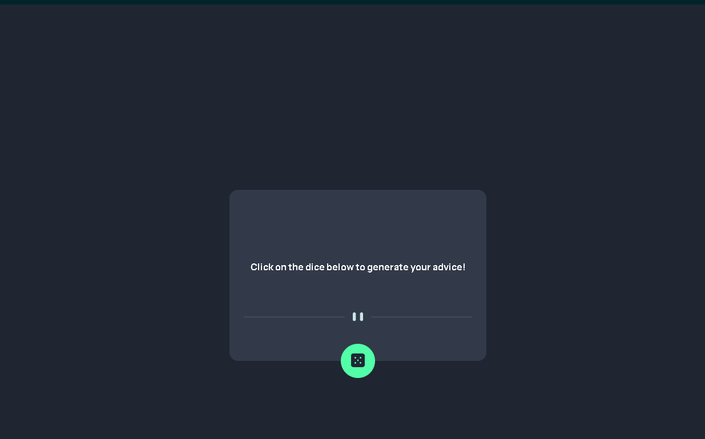

# Aplicativo Gerador de Conselhos

## Visão geral

Este é um desafio do módulo de front-end do curso DevQuest do canal Dev em Dobro e do Frontend Mentor.

[Frontend Mentor Desafio](https://www.frontendmentor.io/challenges/advice-generator-app-QdUG-13db)

### Resultado

[Clique aqui para ver a página Web do projeto](https://guilherme-dangelo.github.io/app-gerador-de-conselhos/)

## Meu processo

### Feito com:

- Marcação semântica HTML
- CSS
- JavaScript
- API

### O que eu aprendi:

Eu quebrei um pouco a cabeça com a utilização da API e algumas partes do JS em geral, porém eu acredito que melhorei bastante na parte de posicionamento, divisão de responsabilidades e Aprimoramento de código para melhor utilização por parte do usuário.

## Autor

- Github - [Guilherme D'Angelo](https://github.com/Guilherme-DAngelo)
- Linkedin - [Guilherme D'Angelo](https://www.linkedin.com/in/guilherme-d-655705218/)
